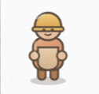
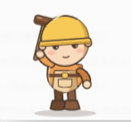
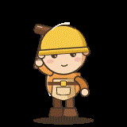

# hermes-skills

Six skills for Hermes Agent and Claude Code that make the model plan before it produces,
and then check what it actually produced.

Both answer the same failure. Given *"build me a tower defense game"* or *"draw me a knight"*,
a language model goes straight to output. You get a pile of features nobody asked for, or an SVG
with floating limbs and muddy colours. Each skill puts a staged process in front of the work, and
every stage carries **pass conditions**. The model is not allowed to call something finished until
it meets them, and it must say which condition it failed.

| Skill | What it does |
|---|---|
| [`game-design-doc`](game-design/game-design-doc/SKILL.md) | Turns "make a game" into a design document before a line of code exists. Forces the core of the fun into a single sentence, then derives mechanics, visuals and rationale from it. Stops at the document and hands the decision back to a human. |
| [`svg-character-design`](creative/svg-character-design/SKILL.md) | Draws game-ready characters and objects (towers, bases, rocks, props) as hand-authored SVG. Silhouette, then layer plan, then draw, then rasterize and answer a seven-point critique, then fix. Three rounds maximum. Objects get footprint, mount points for engine-animated parts, and state variants instead of anatomy. |
| [`svg-game-ui`](creative/svg-game-ui/SKILL.md) | Game UI and HUD as SVG: 9-slice panels, buttons with states derived from one file, inventory slots, item and ability icons, bars as frame + fill. Ships a checker that stretches panels the way the engine will and diffs every icon pair so look-alikes get named. |
| [`svg-tileset`](creative/svg-tileset/SKILL.md) | Seamless tiles and 16 / 47-tile autotile sets, packed into an atlas with a JSON map. The checker lays each tile next to itself and counts the rows that break at the seam, then tests every pair of variants against each other. |
| [`japanese-narration`](media/japanese-narration/SKILL.md) | Japanese narration on the Mac alone — no cloud API, no cost, offline. Wraps Irodori-TTS through a single `say-ja` command, carries the script rules that stop the model mis-reading (spell acronyms in kana, never end on a short sentence), and treats transcribe-and-compare as a pass condition rather than an option. |
| [`godot-web-export`](godot/godot-web-export/SKILL.md) | Checks a Godot export against the way it will actually run. Loads the shipped pack and replays the game's own lookups, because the editor and the export are different filesystems and the gap between them fails silently. |

## The third skill exists because the first two were not enough

`svg-character-design` produced the worker above. It went into a Godot game, the game ran in the
editor, and the browser build shipped with every character invisible. No exception, no warning,
no failed load.

The cause: in an exported project the source `.png` files are gone from their folder and only
`.import` entries remain, so code that lists a directory and filters by extension collects zero
frames. It works in the editor and returns nothing in the export.

That is not a bug a debugging skill catches, because nothing reports a failure. It is caught by
running a check against the artifact you actually ship. `godot-web-export` is that check, and it
fails the build rather than asking anyone to be more careful.

Both are tuned for mid-size local models (Qwen3.x 27B class), where "just draw it" fails hardest.
They work the same way on a frontier model.

## What the process changes

The same local model (Qwen3.8-27B), asked for the same character: a construction worker for a game.
Left, drawing it directly. Right, drawing it through `svg-character-design`.

| Straight to output | Through the skill |
|:---:|:---:|
|  |  |

Four things the staged process bought, all of them checklist items rather than taste:

- **The outline is no longer a blob.** The tool over the shoulder breaks the silhouette
  diagonally, so the figure is identifiable from its shape alone. This is what the
  silhouette-first step exists to force.
- **Values separate.** The left figure is beige on beige, so the plank it is holding merges
  into the torso and stops reading as an object. The right one splits into helmet, jacket
  and boots at a glance.
- **One light direction.** Base and shadow pairs run consistently down one side, instead of
  flat fills.
- **The face carries an expression.** Eyebrows and blush do the work that two dots cannot.

Neither drawing is elaborate, and that is the point: this is what a mid-size local model can
produce when the process asks for a silhouette before it asks for detail.

### The layers are why it animates



Step 3 of the pipeline is a layer plan, and it is not tidiness for its own sake. It writes the
figure as named `<g>` groups ordered back to front, along the lines of

```
back-arm → legs → torso → front-arm → head → face → props
```

so a motion tool can rotate one arm without touching the rest. A character drawn as one merged
path can only be moved as a whole, which is where "AI-generated SVG" usually stops.

On the right, the same worker driven by [HyperFrames](https://www.npmjs.com/package/hyperframes):
twelve frames, a 1.5-second loop. Nothing was redrawn for the animation. The groups were already
there.

<br clear="all">


## Install

```bash
git clone git@github.com:masa55jp/hermes-skills.git
cd hermes-skills && ./install.sh
```

The layout mirrors `~/.hermes/skills/`, so the installer syncs only the two skill folders. It never
overwrites a whole category, because `creative/` also holds skills written by other people. Set
`HERMES_SKILLS_DIR` to install somewhere else.

## Requirements

`game-design-doc` needs nothing.

`svg-character-design`, `svg-game-ui` and `svg-tileset` need a rasterizer and Pillow. On macOS:

```bash
brew install resvg librsvg && pip3 install pillow
```

Any one of `resvg`, `librsvg`, `cairosvg` (pip) or Inkscape will do. `resvg` is the default because
it is the most faithful static SVG renderer of the four. A second engine is worth having, because
`render_preview.py --compare` draws the file with every engine present, puts them side by side with
a diff tile, and prints the share of pixels that disagree:

```
resvg vs rsvg      差分  1.39% のピクセル
 → わずかな差。アンチエイリアスの違いの範囲
```

Under half a percent is a match. A few percent is anti-aliasing. Above that, the red areas of the
diff tile are shapes that will break in a renderer you do not control, which is the one your art
will actually ship on.

With no rasterizer installed, the script falls back to macOS `qlmanage` and headless Chrome. Both
flatten the image onto an opaque white background, which silently breaks the silhouette check and
transparent export. Treat them as an emergency, not a setup.

## Why pass conditions

The design document skill takes its structure from a piece of advice Capcom published for a student
competition, and the sharpest claim in it is this:

> If the core is good, iteration makes the game fun.
> If the core is not good, building more of it does not.

"We'll make it fun as we go" only works when the core is already good. So the question worth
answering first is whether the core survives being written as one sentence. The same logic drives
the SVG skill: a character that reads at 64 px was designed at the silhouette stage, and no amount
of shading rescues one that wasn't.

## Attribution

`game-design-doc` builds on the four-step structure Capcom published for entrants to
[CAPCOM GAMES COMPETITION 2027](https://www.capcom-games.com/cgc2027/ja-jp/game-design-document/).
The original is text inside slide images, ©CAPCOM. This skill restates the points and the pass
criteria in its own words.

## License

MIT. See [LICENSE](LICENSE).

---

# 日本語

Hermes Agent / Claude Code 用に書いた自作スキル6本。「AIにいきなり作らせない」ための道具と、
「作ったものが本当に動くか測る」ための道具。絵のスキルは3本とも、自分の出力を測る検査を同梱している。

「タワーディフェンスを作って」「ナイトを描いて」と言うと、LLMは計画を飛ばして出力に走る。
結果、誰も頼んでいない機能の寄せ集めになるか、浮いた手足と濁った色のSVGになる。
そこで工程を分け、各段階に**通過条件**を置いた。満たさないものを「完成」と呼ばせない。
未達があれば、どこが未達かを明示させる。

| スキル | 何をするか |
|---|---|
| [`game-design-doc`](game-design/game-design-doc/SKILL.md) | ゲームを作る依頼を、コードを書く前に企画書に変える。面白さの核を一文で言い切らせ、そこから仕組み・絵・理由を組み立てる。企画書で止め、判断は人間に返す |
| [`creative/svg-character-design`](creative/svg-character-design/SKILL.md) | ゲーム用のキャラクターと設置物（塔・基地・岩・小物）を手書きSVGで描く。シルエット → レイヤー構成 → 描画 → ラスタライズして7項目の自己批評 → 修正。最大3周。設置物は解剖学の代わりに、接地面・エンジンが動かす部品の取り付け位置・状態差分を持つ |
| [`creative/svg-game-ui`](creative/svg-game-ui/SKILL.md) | ゲームのUIとHUDをSVGで。9分割パネル、1ファイルから状態を派生させるボタン、インベントリの枠、アイテムと能力のアイコン、枠と中身を分けたゲージ。検査はパネルをエンジンと同じ方法で引き伸ばし、アイコンの全組を比較して似すぎた組を名指しする |
| [`creative/svg-tileset`](creative/svg-tileset/SKILL.md) | 継ぎ目のないタイルと16 / 47枚のオートタイル、アトラスとJSONへの詰め込み。検査はタイルを自分の隣に並べ、境界で途切れる行を数える。バリアント同士の総当たりも見る |
| [`media/japanese-narration`](media/japanese-narration/SKILL.md) | 日本語ナレーションをMacだけで作る。クラウドAPI不使用・無料・オフライン。`say-ja` 一発で呼べる形にし、読み間違いを防ぐ台本のルール（英字略語はカナに開く／締めを短くしない）と、書き起こして照合する工程を通過条件にしている |
| [`godot/godot-web-export`](godot/godot-web-export/SKILL.md) | 書き出したGodotを、実際に動く形で検査する。出荷する pack を読み込み、ゲームと同じ呼び出しを再現する。エディタと書き出し版は別のファイルシステムで、その差は無言で壊れる |

## 3本目がある理由 —— 前の2本では足りなかった

`svg-character-design` で上の作業員ができた。Godotのゲームに載せ、エディタでは動いた。
そしてブラウザ版は、**キャラクターが全員消えた状態で公開された。**
例外も警告も、読み込み失敗も出ていない。

原因は、書き出すと元の `.png` がフォルダから消えて `.import` だけが残ること。
フォルダを一覧して拡張子で絞るコードは、**エディタで16枚・書き出し版で0枚**になる。

★ これはデバッグのスキルでは捕まらない。**何も失敗を報告していない**から、調査が始まらない。
捕まえる方法は、**実際に出荷する成果物に対して検査を通すこと**だけ。
`godot-web-export` はその検査で、「もっと慎重に」ではなく**ビルドを落とす。**

どちらも中規模のローカルLLM（Qwen3.x 27B級）を想定して調整してある。「とりあえず描いて」が
いちばん破綻する層。フロンティアモデルでも同じように動く。

## 工程を挟むと何が変わるか

同じローカルモデル（Qwen3.8-27B）に、同じお題（ゲームで使う作業員）を描かせた比較。
左がそのまま描かせたもの、右が `svg-character-design` を通したもの。

| そのまま描かせる | スキルを通す |
|:---:|:---:|
|  |  |

変わったのは4点。**どれもセンスではなくチェック項目**で取れている。

- **輪郭が塊でなくなった。** 肩に担いだ道具が斜めにシルエットを破るので、形だけで何者か分かる。
  「先にシルエットを決めさせる」工程は、これを起こすためにある
- **明度が分かれた。** 左はベージュの上にベージュで、抱えている板が胴に溶けて物として読めない。
  右はヘルメット・上着・ブーツが一目で分離する
- **光の向きが1つに揃った。** べた塗りではなく、ベース色と影色の組が片側に通っている
- **顔に表情が乗った。** 眉と頬の赤みが、点2つでは出せない仕事をしている

どちらも凝った絵ではない。**そこが要点**で、これは中規模のローカルモデルが、
ディテールより先にシルエットを聞かれたときに出せる水準。

### レイヤーに分けたから動く


工程3のレイヤー計画は、整理整頓のためではない。**図形を名前付きの `<g>` グループに、
奥から手前の順で書かせる。**

```
back-arm → legs → torso → front-arm → head → face → props
```

こうしておくと、**片腕だけを回しても他が動かない。**
1本のパスに統合されたキャラクターは、全体としてしか動かせない。
「AIが描いたSVG」がたいてい止まるのはここ。

右は同じ作業員を [HyperFrames](https://www.npmjs.com/package/hyperframes) で動かしたもの。
12フレーム、1.5秒ループ。**アニメーションのために描き直したものは無い。**
グループは最初から分かれていた。

<br clear="all">


## 入れ方

```bash
git clone git@github.com:masa55jp/hermes-skills.git
cd hermes-skills && ./install.sh
```

`~/.hermes/skills/` と同じ構造なので、該当2フォルダだけを同期する。`creative/` には他人が作った
スキルも同居しているため、カテゴリごと上書きはしない。別の場所に入れるなら `HERMES_SKILLS_DIR` を指定する。

## 必要なもの

`game-design-doc` は何も要らない。`svg-character-design` は自己批評のためにラスタライザが1つ要る。

```bash
brew install resvg librsvg
```

`resvg` が主力。`librsvg` は2本目で、`--compare` を付けると両方で描いて並べ、食い違ったピクセルの
割合を出す。ゲームに載せるSVGは自分の手元にないレンダラで描かれるので、1つのエンジンで見て
満足すると刺さる。

どちらも無い環境では `qlmanage` と headless Chrome に落ちるが、この2つは**不透明な白背景に
焼き込む**ため、シルエット確認と透明PNG書き出しが壊れる。非常用と考える。

## 出典

`game-design-doc` は、カプコンが学生向けコンペ
[CAPCOM GAMES COMPETITION 2027](https://www.capcom-games.com/cgc2027/ja-jp/game-design-document/)
の応募者に向けて公開した「ゲーム企画書の作り方」の4ステップ構成を下敷きにしている。
原文はスライド画像内のテキストで ©CAPCOM。このスキルは要点と判定基準を自分の言葉で書き直したもの。
